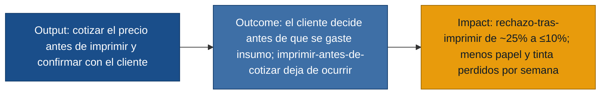
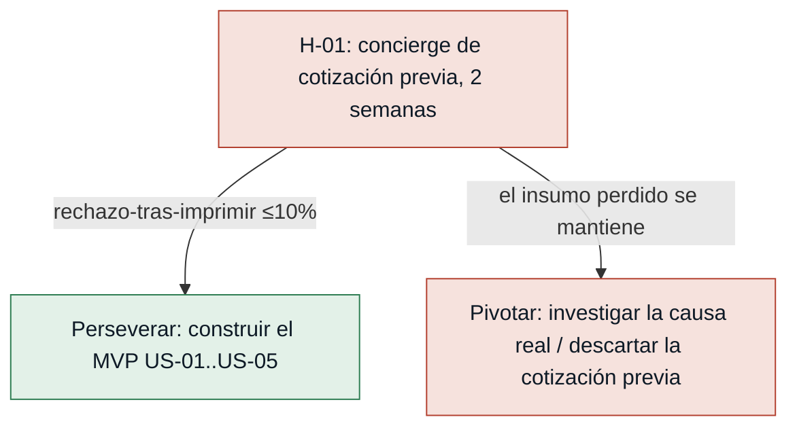
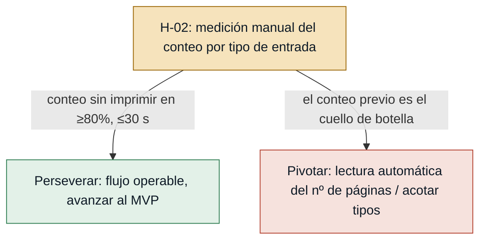
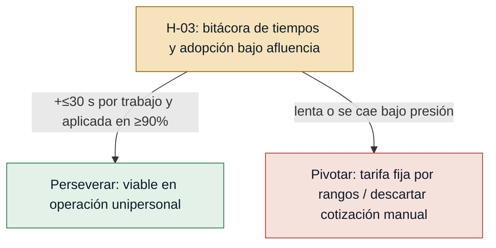
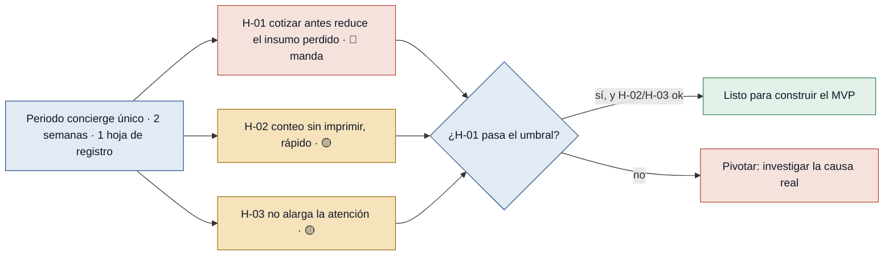

# Hipótesis y Experimentos — Cotización previa de impresiones

**Fecha:** 2026-06-29
**Discovery:** `bazarpapeleria` · **MVP:** Cotización previa de impresiones
**Fuentes:** `mvp-canvas.md`, `requisitos.md`, `evidence-map.json` (derivado a su
vez de `propietaria.md`, `propietaria_seguimiento.md`, `observador.md`, `cliente.md`).

Fase posterior al MVP. Toma los **supuestos riesgosos** del MVP Canvas y los
convierte en hipótesis **falsables**, cada una con el experimento **más barato**
que la responde. Todo es trazable a la evidencia; cero invención.

**Métrica de éxito del MVP (lo que queremos mover):** nº de impresiones ejecutadas
y luego rechazadas por semana (insumo perdido) → debe **bajar**.
**Línea base:** ~25% de las atenciones de impresión terminan en rechazo *tras*
imprimir (1 de 4 observadas) y "varias veces a la semana": 2–3 trabajos en semana
mala, ~1 en semana normal (observador.md, propietaria_seguimiento.md).

---

## Cadena output → outcome → impact

La propuesta de valor es una **hipótesis**: cotizar antes solo importa si mueve la
métrica. La cadena es lo que el experimento debe comprobar.

> Las hipótesis son los **puentes** de esta cadena. La deseabilidad (que el cliente
> quiere el precio antes) ya está validada de primera mano (cliente.md); lo que
> falta probar es que el output mueva la métrica. Si un supuesto falla, la cadena
> se corta antes de producir impacto.

---

## Orden de prioridad por riesgo

Riesgo = impacto de equivocarse × incertidumbre. Se prueba primero lo que más
puede tumbar el MVP. Las tres corren en el **mismo** periodo concierge.

| # | Hipótesis | Riesgo | Experimento | Caja de tiempo |
|---|---|---|---|---|
| H-01 | Cotizar antes reduce el insumo perdido (no solo adelanta el rechazo) | 🔴 Alto | Concierge / Mago de Oz + hoja de registro | 2 semanas · sin desarrollo |
| H-02 | Se puede contar las páginas sin imprimir, rápido | 🟡 Medio | Medición manual cronometrada por tipo de entrada | Incluido en las 2 semanas · cronómetro |
| H-03 | La cotización no alarga la atención ni se abandona bajo presión | 🟡 Medio | Observación + bitácora de tiempos y adopción | Incluido en las 2 semanas |

---

## Test cards

### [H-01] Cotizar antes reduce el insumo perdido — riesgo: 🔴 **alto**

- **Supuesto a probar:** que cotizar antes **reduce el insumo perdido** por semana,
  y no solo adelanta la cancelación. La **deseabilidad ya está validada** de primera
  mano: el cliente confirma que querría conocer el precio antes para decidir si paga
  o busca otro lado (cliente.md). Lo que falta es el **comportamiento de negocio**:
  que ese cambio de orden baje el papel/tinta gastado sin ingreso (mvp-canvas.md
  riesgo #1, observador.md paso crítico #2).
- **Hipótesis:** Creemos que la **propietaria** reducirá las impresiones ejecutadas
  y luego rechazadas **si** dice el precio y pide confirmar **antes** de imprimir,
  **porque** el cliente declara que con el precio por adelantado decidiría antes de
  gastar (cliente.md) y el rechazo observado ocurre justo al revelar el costo recién
  después de impreso (observador.md, paso crítico #2).
- **Señal medible:** nº de impresiones ejecutadas y luego rechazadas por semana
  (papel/tinta gastados sin ingreso). *No de vanidad: si baja, baja el gasto real
  perdido y la propietaria recupera dinero para mantenimiento e insumos.*
- **Criterio de éxito:** en 2 semanas, el rechazo-tras-imprimir baja de ~25% a
  **≤10%** de las atenciones de impresión (caída **≥60%** del insumo perdido por
  semana frente a la línea base).
- **Experimento:** **Concierge / Mago de Oz** — sin construir software. Durante
  2 semanas la propietaria cuenta/estima las páginas, dice el precio y pide
  confirmar o cancelar **antes** de imprimir; registra cada trabajo en una hoja
  simple: cotizó-antes (sí/no), aceptó, rechazó-antes, rechazó-después.
- **Caja de tiempo/costo:** 2 semanas de operación normal + 1 hoja de registro.
  Sin desarrollo.
- **Regla de decisión:** **Si pasa →** el precio sorpresa era la causa: construir el
  MVP de cotización previa (US-01..US-05). **Si falla →** el rechazo no se explica
  por desconocer el precio: **pivotar** (investigar la causa real —precio alto vs.
  competencia, expectativa del cliente—) y **descartar** la cotización previa como
  remedio del rechazo antes de invertir en construir.

---

### [H-02] Se puede contar las páginas sin imprimir, rápido — riesgo: 🟡 **medio**

- **Supuesto a probar:** que el nº de páginas se obtiene rápido y **sin imprimir**
  para los tres tipos de entrada (USB, celular, documento físico). Si no, la
  cotización previa es inoperable en el flujo real (mvp-canvas.md riesgo #2,
  propietaria_seguimiento.md).
- **Hipótesis:** Creemos que la **propietaria** podrá cotizar antes de imprimir
  **si** obtiene el nº de páginas y el tipo sin ejecutar el trabajo, **porque** el
  obstáculo que ella misma declara no es de voluntad sino de herramienta: "uno no
  sabe cuántas hojas son hasta que ya las imprimió" (propietaria_seguimiento.md).
- **Señal medible:** % de trabajos en que se logra el nº de páginas correcto antes
  de imprimir, y segundos que toma obtenerlo. *No de vanidad: marca si el flujo de
  cotización previa es operable.*
- **Criterio de éxito:** en las 2 semanas, se obtiene el nº de páginas sin imprimir
  en **≥80%** de los trabajos y en **≤30 segundos** cada uno (error de conteo
  ≤1 página).
- **Experimento:** **medición manual** dentro del mismo periodo concierge:
  cronometrar la obtención del conteo por tipo de entrada (USB/celular = páginas del
  archivo en pantalla; físico = conteo directo de hojas) y anotar aciertos y
  tiempos.
- **Caja de tiempo/costo:** incluido en las 2 semanas de H-01 + un cronómetro. Sin
  desarrollo.
- **Regla de decisión:** **Si pasa →** la cotización previa es operable con el flujo
  actual: avanzar al MVP. **Si falla →** el conteo previo es el cuello de botella:
  **pivotar** (lectura automática del nº de páginas del archivo, o acotar el MVP a
  los tipos de entrada donde sí se logra) antes de prometer cotización universal.

---

### [H-03] La cotización no alarga la atención ni se abandona bajo presión — riesgo: 🟡 **medio**

- **Supuesto a probar:** que el paso de cotización no alarga la atención ni se
  abandona bajo presión, dado que la propietaria atiende **sola** y a veces con
  varios clientes, y que el cliente valora la rapidez por encima de todo y no debe
  sacrificarse (mvp-canvas.md riesgo #3, propietaria_seguimiento.md, observador.md,
  cliente.md). Es el supuesto de viabilidad/adopción.
- **Hipótesis:** Creemos que la **propietaria** sostendrá la cotización previa en su
  operación real **si** cotizar antes no le quita tiempo, **porque** su restricción
  declarada es simplicidad y velocidad ("algo sencillo, que no me haga perder más
  tiempo del que ya tengo", propietaria_seguimiento.md) y el cliente valora ante
  todo la rapidez del servicio (cliente.md, R-09, R-10).
- **Señal medible:** tiempo medio de atención por trabajo de impresión (con
  cotización vs. línea base) y % de trabajos en que efectivamente aplicó la
  cotización previa. *No de vanidad: si cae bajo presión, el MVP no se usará.*
- **Criterio de éxito:** en las 2 semanas, el tiempo medio de atención por trabajo
  no aumenta más de **30 segundos** frente a la línea base, y aplica la cotización
  previa en **≥90%** de los trabajos (no la abandona en afluencia alta).
- **Experimento:** **observación + bitácora** dentro del periodo concierge:
  registrar tiempo de atención por trabajo y si aplicó la cotización, separando
  momentos de baja y alta afluencia.
- **Caja de tiempo/costo:** incluido en las 2 semanas de H-01. Sin desarrollo.
- **Regla de decisión:** **Si pasa →** la cotización previa es viable en operación
  unipersonal: avanzar al MVP cuidando la velocidad. **Si falla →** el paso es lento
  o se cae bajo presión: **pivotar** (simplificar al extremo —tarifa fija por rangos
  de páginas, precio en un toque— y reprobar); si aun así se abandona, **descartar**
  la cotización manual y replantear la solución.

---

## Secuencia de aprendizaje recomendada

Las tres hipótesis se prueban en **un mismo experimento concierge de 2 semanas**
(una sola hoja de registro). **H-01 manda**: si cotizar antes no reduce el insumo
perdido, H-02 y H-03 dejan de importar. La deseabilidad ya no se prueba aquí —el
cliente la confirmó de primera mano (cliente.md)—; el experimento se concentra en
el **comportamiento de negocio**. De paso instrumenta H-02 (tiempos y aciertos del
conteo) y H-03 (tiempo de atención y adopción bajo presión). Una sola observación
compra la respuesta a las tres.

