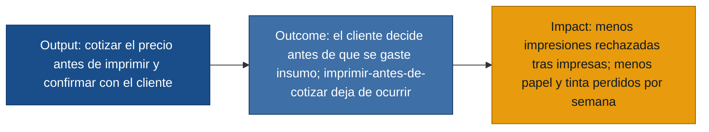

# MVP Canvas — Cotización previa de impresiones (Bazar / Papelería)

Anclado en la persona **Propietaria** (`primera mano`: propietaria.md,
propietaria_seguimiento.md), con la deseabilidad del **Cliente de impresiones**
ahora validada de primera mano (`primera mano`: cliente.md). Todo el contenido es
trazable a las entrevistas; los supuestos aún no validados se declaran en
*Riesgos / supuestos*.

## MVP Canvas — Cotización previa de impresiones

| Bloque | Contenido |
|---|---|
| Propuesta de valor | Cotizar la impresión **antes** de ejecutarla, para que el cliente confirme el precio y la propietaria deje de gastar papel y tinta en trabajos que se rechazan al conocer el costo (propietaria.md, propietaria_seguimiento.md). El cliente gana previsibilidad y decide antes de imprimir si gasta ahí o busca otra opción (cliente.md). |
| Segmento de usuarios | **Propietaria**, dueña y única operadora (usuaria directa que opera la cotización). **Cliente de impresiones**, usuario frecuente (uso diario) que recibe el precio antes de imprimir — ahora con respaldo de primera mano (cliente.md). |
| Funcionalidades mínimas | US-01 calcular precio por nº de páginas y tipo antes de imprimir; US-02 conocer el nº de páginas sin imprimir; US-03 configurar la tarifa por tipo; US-04 mostrar el precio y confirmar/cancelar antes de imprimir; US-05 que el cliente conozca el precio antes para decidir (user-stories.md). |
| Resultado esperado (outcome) | El orden del proceso cambia: la cotización ocurre **antes** de imprimir; el cliente decide antes de que se consuma insumo (observador.md, paso crítico #2). |
| Métrica de éxito | Nº de impresiones ejecutadas y luego rechazadas (insumo perdido) por semana → debe **bajar**. Línea base observada: ~25% de rechazo (1 de 4 atenciones) y "varias veces a la semana" (observador.md, propietaria_seguimiento.md). |
| Riesgos / supuestos | (1) Que cotizar antes **reduce el insumo perdido**: el cliente confirma que querría saber el precio antes para decidir (cliente.md), pero falta probar que eso baja el rechazo *tras imprimir* y no solo lo adelanta. (2) Que el nº de páginas se obtiene rápido sin complicar el flujo. (3) Que el paso de cotización no alargue la atención ni sacrifique la rapidez que el cliente más valora, dado que la propietaria trabaja sola (propietaria_seguimiento.md, observador.md, cliente.md). |
| Fuera de alcance (por ahora) | Registro y reporte de pérdidas (US-06, US-08), separación contable papelería/impresiones (US-07), costeo de insumos (US-09), inventario de insumos y canal de pedidos remoto. Por qué: no son imprescindibles para entregar el cambio de orden cotizar→imprimir; pueden venir una vez probado el núcleo. |

## El puente output → outcome → impact

> **Nota de respaldo:** ambas personas del MVP tienen entrevista de primera mano
> (Propietaria y Cliente de impresiones). La deseabilidad —que el cliente quiere
> conocer el precio antes— está validada (cliente.md). Lo que aún **no** está
> probado es el outcome de negocio: que cotizar antes *reduzca* el insumo perdido
> por semana (hoy es intuición de la propietaria + deseo declarado del cliente, no
> un dato de comportamiento). Ese es el supuesto a poner a prueba con un
> experimento barato antes de invertir en construir.
