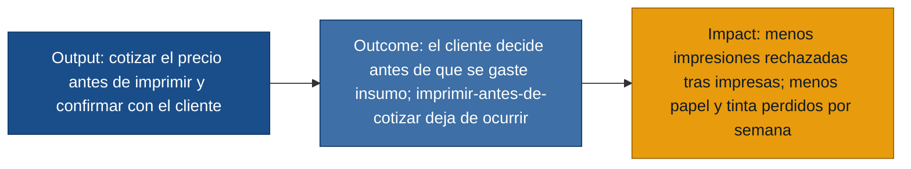

# MVP Canvas — Cotización previa de impresiones (Bazar / Papelería)

Anclado en la persona **Propietaria** (`primera mano`: propietaria.md,
propietaria_seguimiento.md). Todo el contenido es trazable a las entrevistas; los
supuestos aún no validados se declaran en *Riesgos / supuestos*.

## MVP Canvas — Cotización previa de impresiones

| Bloque | Contenido |
|---|---|
| Propuesta de valor | Cotizar la impresión **antes** de ejecutarla, para que el cliente confirme el precio y la propietaria deje de gastar papel y tinta en trabajos que se rechazan al conocer el costo (propietaria.md, propietaria_seguimiento.md). |
| Segmento de usuarios | **Propietaria**, dueña y única operadora (usuaria directa). *Cliente de impresiones* como beneficiario indirecto — `referenciado`, sin entrevista de primera mano (observador.md). |
| Funcionalidades mínimas | US-01 calcular precio por nº de páginas y tipo antes de imprimir; US-02 conocer el nº de páginas sin imprimir; US-03 configurar la tarifa por tipo; US-04 mostrar el precio y confirmar/cancelar antes de imprimir (user-stories.md). |
| Resultado esperado (outcome) | El orden del proceso cambia: la cotización ocurre **antes** de imprimir; el cliente decide antes de que se consuma insumo (observador.md, paso crítico #2). |
| Métrica de éxito | Nº de impresiones ejecutadas y luego rechazadas (insumo perdido) por semana → debe **bajar**. Línea base observada: ~25% de rechazo (1 de 4 atenciones) y "varias veces a la semana" (observador.md, propietaria_seguimiento.md). |
| Riesgos / supuestos | (1) Que conocer el precio antes evita el rechazo — la propietaria lo intuye pero no está validado (propietaria_seguimiento.md). (2) Que el nº de páginas se obtiene rápido sin complicar el flujo. (3) Que el paso de cotización no alargue la atención, dado que trabaja sola (propietaria_seguimiento.md, observador.md). |
| Fuera de alcance (por ahora) | Registro y reporte de pérdidas (US-05, US-07), separación contable papelería/impresiones (US-06), costeo de insumos (US-08), inventario de insumos y canal de pedidos remoto. Por qué: no son imprescindibles para entregar el cambio de orden cotizar→imprimir; pueden venir una vez probado el núcleo. |

## El puente output → outcome → impact

> **Nota de respaldo:** el MVP se sostiene en la *Propietaria* (primera mano). El
> *Cliente de impresiones* sigue `referenciado`; el supuesto clave —que cotizar
> antes evita el rechazo— debe validarse con un experimento antes de invertir en
> construir, ya que hoy es una intuición de la propietaria, no un dato.
