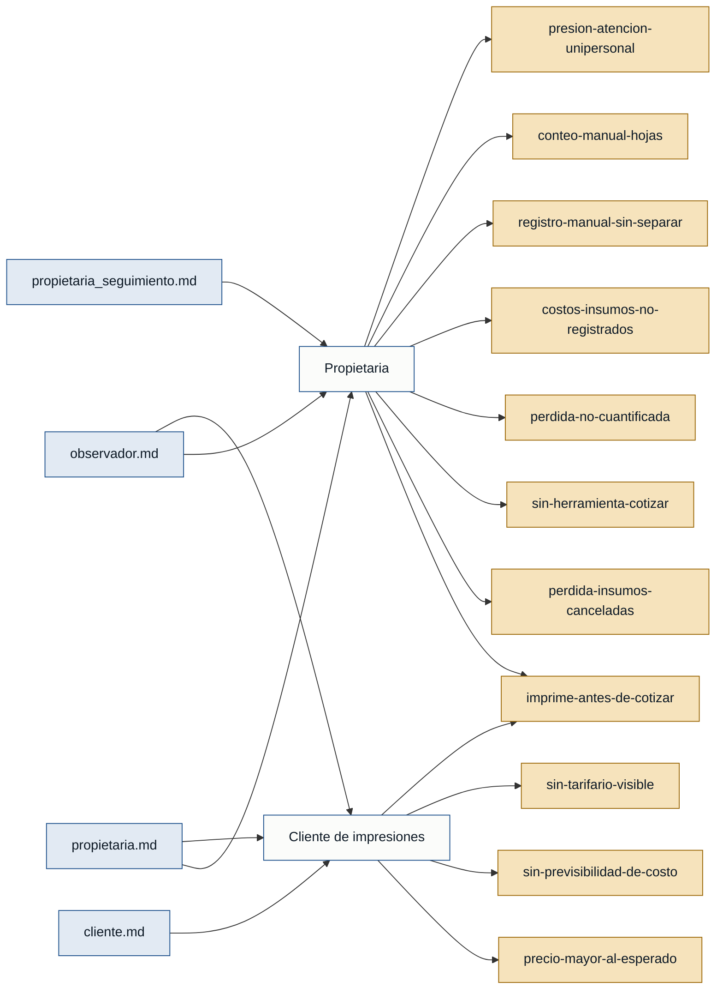

# Personas y stakeholders — Bazar / Papelería

Evidencia base: `propietaria.md` y `propietaria_seguimiento.md` (primera persona,
rol *propietaria*), `observador.md` (observación directa, rol *observador*) y
`cliente.md` (primera persona, rol *cliente*).

## Personas

### Propietaria — dueña y única operadora del negocio
- **Contexto:** Atiende sola una papelería con servicio de impresiones; registra
  todo a mano en un cuaderno, sin sistema digital ni caja registradora
  (propietaria.md).
- **Objetivo principal:** Cobrar todo el trabajo de impresión que ejecuta y dejar
  de perder insumos en trabajos que el cliente rechaza al conocer el precio
  (propietaria.md, propietaria_seguimiento.md).
- **Dolores:**
  - Imprime antes de cotizar; el precio se informa recién al final (observador.md, propietaria.md).
  - Pierde papel, tinta y tiempo de máquina cuando el cliente rechaza el precio ya impreso (propietaria.md).
  - No tiene forma simple de calcular el precio antes de ver el documento ya procesado (propietaria_seguimiento.md).
  - No cuantifica la pérdida; solo la percibe como frecuente, sin un número (propietaria.md, propietaria_seguimiento.md).
  - No conoce el costo real de insumos por impresión; fija el precio "de memoria" y por la competencia (propietaria_seguimiento.md).
  - Lleva todo a mano y sin separar ingresos de papelería de los de impresiones (propietaria.md, observador.md).
  - Cuenta hojas y calcula el precio de forma manual, de memoria (observador.md).
  - Trabaja sola: con varios clientes el ritmo se acelera y cotizar antes es aún más difícil (propietaria_seguimiento.md, observador.md).
- **Respaldo:** `primera mano` (propietaria.md, propietaria_seguimiento.md).

### Cliente de impresiones — quien lleva documentos a imprimir
- **Contexto:** Cliente frecuente que usa el servicio a diario, principalmente
  para tareas escolares de sus hijos; llega con documentos desde USB, celular o un
  físico para copias, y no pregunta el precio antes de pedir el trabajo
  (cliente.md, observador.md).
- **Objetivo principal:** Obtener sus impresiones rápido y con previsibilidad de
  costo, para decidir **antes de imprimir** si vale la pena gastar ahí o buscar
  otra opción (cliente.md).
- **Dolores:**
  - El precio resulta más alto de lo esperado, incluso en trabajos pequeños (p. ej. una sola hoja con imagen) (cliente.md).
  - Conoce el precio total recién cuando el trabajo ya está impreso; eso le genera sorpresas desagradables y le quita la posibilidad de decidir (cliente.md, observador.md).
  - No tiene ninguna referencia de costo al entrar: no hay tarifario visible (observador.md).
  - Valora la rapidez del servicio y teme perderla; cualquier cotización previa no debe sacrificar la velocidad que hoy aprecia (cliente.md).
- **Respaldo:** `primera mano` (cliente.md).

## Stakeholders

### Propietaria (como dueña del negocio)
- **Interés en el sistema:** Recuperar el dinero que hoy se pierde en impresiones
  canceladas y poder destinarlo a gastos operativos (mantenimiento de impresoras,
  limpieza del local, reposición de insumos).
- **Fuente:** propietaria.md, propietaria_seguimiento.md.

### Otras papelerías cercanas (competencia)
- **Interés en el sistema:** Interés indirecto. La propietaria asume que enfrentan
  el mismo problema, pero no lo ha confirmado; no son usuarias ni decisoras del
  sistema. Se incluye solo para dejar constancia del entorno.
- **Fuente:** propietaria_seguimiento.md.

## Mapa de trazabilidad (entrevistas → personas → dolores)

> **Respaldo de personas:** ambas personas tienen entrevista de **primera mano**
> (Propietaria: propietaria.md / propietaria_seguimiento.md; Cliente de
> impresiones: cliente.md). No quedan personas solo `referenciadas`. El MVP se
> ancla en la *Propietaria* (operadora y dueña del proceso), con la deseabilidad
> del *Cliente de impresiones* ahora validada de primera mano.
